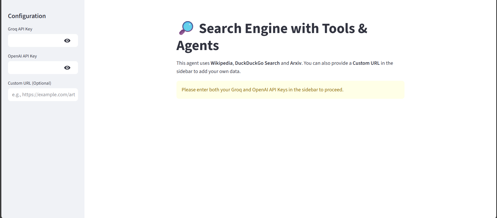

# 🤖 Search Engine

[](https://langchain-search-engine-using-tools-agents.streamlit.app/)


> **An intelligent assistant capable of searching the live web, querying academic papers, referencing Wikipedia, and performing RAG on custom user-provided URLs.**

---

##  Overview

The application uses an LLM (via Groq) as a "reasoning engine." Instead of just answering from training data, the agent decides which tool to use—searching Wikipedia for definitions, Arxiv for research papers, DuckDuckGo for live news, or ingesting a specific website provided by the user to answer questions contextually.

---

##  Key Features

* **Intelligent Tool Routing:** The agent dynamically selects the best tool for the job (e.g., uses Arxiv for "physics papers" but DuckDuckGo for "current stock prices").
* **Custom RAG Pipeline:** Users can input any URL. The system scrapes the content, embeds it, stores it in a FAISS vector database, and allows the LLM to query that specific data.
* **High-Performance Inference:** Powered by **Groq** for near-instantaneous LLM responses.
* **Multi-Source Knowledge:**
    * **Wikipedia:** For general knowledge and history.
    * **Arxiv:** For scientific and technical academic papers.
    * **DuckDuckGo:** For real-time internet search.
* **Interactive UI:** Built with **Streamlit** for a clean, chat-based user experience.

---

##  Tech Stack

| Component | Technology | Description |
| :--- | :--- | :--- |
| **Orchestration** | [LangChain](https://www.langchain.com/) | Managing agents, tools, and chains. |
| **Frontend** | [Streamlit](https://streamlit.io/) | Interactive web interface. |
| **LLM Provider** | [Groq API](https://groq.com/) | Ultra-fast inference for the reasoning engine. |
| **Embeddings** | [OpenAI](https://openai.com/) | `text-embedding-3-large` for high-quality vectorization. |
| **Vector DB** | [FAISS](https://github.com/facebookresearch/faiss) | Efficient similarity search for RAG. |
| **Tools** | Arxiv, Wiki, DuckDuckGo | External APIs integrated as LangChain tools. |

---

##  How It Works (Architecture)

1.  **Input:** The user asks a question and optionally provides a "Custom URL".
2.  **Vectorization (If URL is provided):**
    * The URL is loaded via `WebBaseLoader`.
    * Text is chunked using `RecursiveCharacterTextSplitter`.
    * Chunks are embedded using OpenAI and stored in a temporary **FAISS** vector store.
    * This store is converted into a queryable **Retriever Tool**.
3.  **Agent Reasoning:**
    * The `ChatGroq` model receives the user prompt.
    * It evaluates the available tools: `[wikipedia, arxiv, internet search, custom web search]`.
    * It decides which tool is needed to answer the query.
4.  **Execution & Response:** The agent executes the tool, retrieves the data, generates a natural language response, and displays it in the chat interface.

---

##  Installation & Setup

**Prerequisites:** Python 3.9+

1.  **Install Dependencies**
    ```bash
    pip install -r requirements.txt
    ```

2.  **Run the Application**
    ```bash
    streamlit run app.py
    ```

3.  **Enter API Keys:**
    * Launch the app in your browser.
    * Enter your **Groq API Key** and **OpenAI API Key** in the sidebar.

---

##  Screenshots


[Click here for demo (PDF)](assets/demo.pdf)


---

**Built with ❤️ using LangChain & Streamlit**
